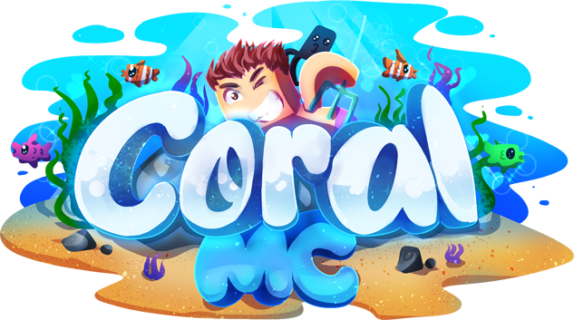
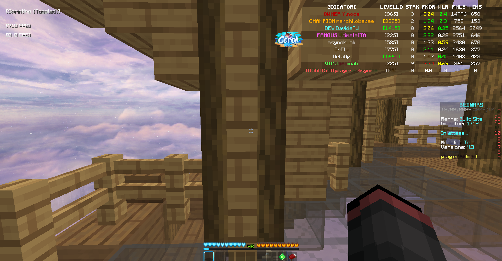

#  CoralOverlay

Il primo overlay per le BedWars di CoralMC è finalmente disponibile! Questo overlay ti permette di vedere i giocatori in disguise e le
loro statistiche appena entrerai in partita. Tutto ciò è stato creato con l'obiettivo di essere semplice e intuitivo da usare,
quindi non preoccuparti se non sei un esperto!

## Funzionalità

- [x] Mostra i giocatori in disguise
- [x] Mostra statistiche come livello, win streak, final kills/death ratio, win/lose ratio, final kills e vittorie
- [x] Mostra il rank del giocatore con il colore corrispondente
- [x] Riconosce i membri dello staff e mostra il loro rank
- [x] Riconosce il client con cui giochi in automatico (supporta Badlion Client, Lunar Client, Forge, Fabric, LabyMod,
  PvPLounge, Optifine e Vanilla)
- [x] Possiede una GUI semplice e intuitiva
- [x] Colori in base al livello, all'FKDR e al WLR

## Installazione

1. Assicurati di avere Java 11.0.3 o superiore e scarica il file jar/exe
   dai [releases (clicca qui)](https://github.com/zMario34/coraloverlay/releases)
2. Avvia il file e inserisci il tuo nome utente quando richiesto
3. Ora entra in una partita.
4. Apri la chat, **clicca spazio** e poi **TAB** per poter rilevare i giocatori in partita.

**Nota:** I giocatori vengono rilevati in automatico (senza dover fare il procedimento al punto 4) solo se entrano dopo
di te nella partita poiché non c'è un modo per rilevare i giocatori già presenti in partita.

## Note da sapere

Se si entra in modalità full-screen, l'overlay non sarà visibile. Per risolvere questo problema, è possibile utilizzare
la modalità finestra o la modalità finestra senza bordi. Purtroppo, non c'è un modo per risolvere questo problema al
momento.

### **In-game**

- `/msg <TUO NOME> <GIOCATORI>`: Aggiunge i giocatori alla lista manualmente. Esempio: `/msg zMario34 Ytnoos Feryzz`

### **GUI applicazione**

- **Click sinistro premuto sul logo di CoralMC**: Muovi la posizione dell'overlay
- **Click destro sul logo di CoralMC**: Minimizza l'overlay
- **Click sulla rotellina sul logo di CoralMC**: Chiudi e termina l'overlay

## Preview

## In progetto

Non ci sono funzionalità in progettazione al momento.

## Supporto

Se hai bisogno di aiuto o hai trovato un bug, puoi contattarmi nel mio server Discord: https://discord.gg/KHtC5FTW6z.
Ricorda di scrivere nella categoria CoralOverlay per una risposta più veloce.
